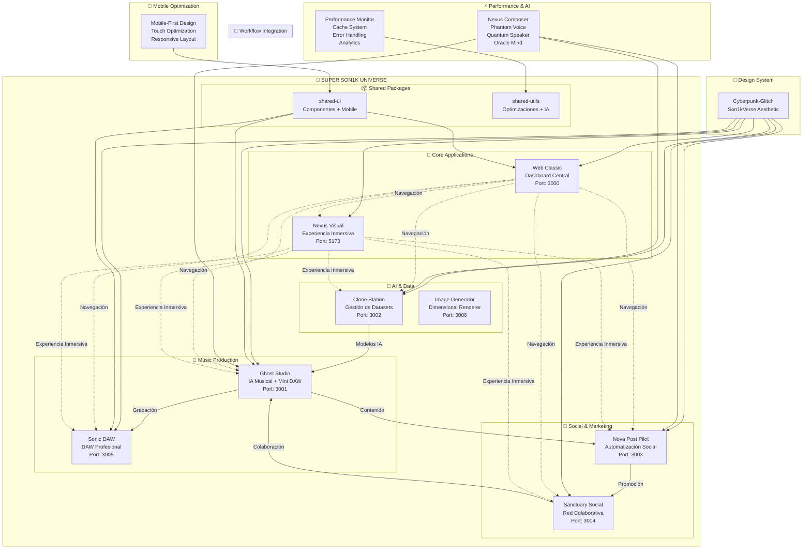
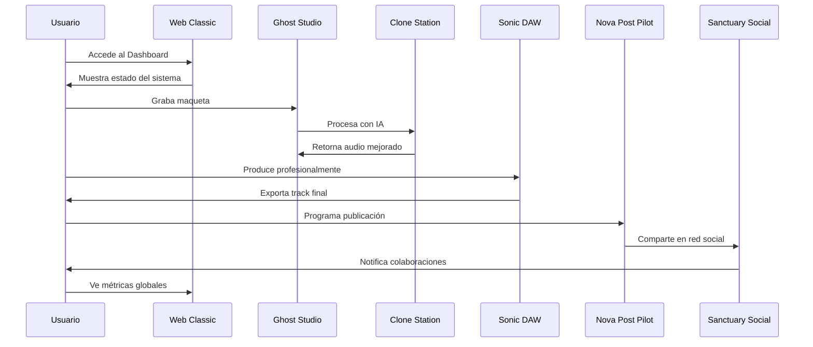
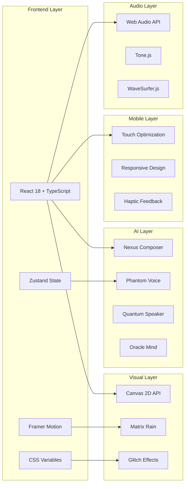

# 🌌 DIAGRAMA DE FLUJO - SUPER SON1K ECOSYSTEM

## Flujo Principal de Trabajo

## Flujo de Usuario Típico

## Arquitectura Técnica

## Métricas de Implementación

| Categoría | Cantidad | Estado |
|-----------|----------|--------|
| **Aplicaciones** | 7 | ✅ 6/7 Completas |
| **Componentes** | 100+ | ✅ Implementados |
| **Utilidades** | 50+ | ✅ Implementadas |
| **Tipos TypeScript** | 200+ | ✅ Implementados |
| **Hooks Personalizados** | 30+ | ✅ Implementados |
| **Efectos Visuales** | 15+ | ✅ Implementados |
| **Optimizaciones** | 20+ | ✅ Implementadas |
| **Tests** | 0 | 🔄 Pendiente |
| **PWA Features** | 0 | 🔄 Pendiente |
| **Backend/API** | 0 | 🔄 Pendiente |

## Tecnologías Únicas

### 🎨 **Sistema de Diseño Cyberpunk-Glitch**
- Paleta de colores única y distintiva
- Efectos visuales de nivel cinematográfico
- Tipografías 8-bit y modernas
- Animaciones fluidas con Framer Motion

### 🤖 **IA Integrada con Nombres Alegóricos**
- Protección de secretos institucionales
- Nombres únicos del universo Son1kVerse
- Integración perfecta en el flujo de trabajo
- Generación de contenido automática

### 📱 **Mobile-First Design**
- Responsive design completo
- Touch optimization avanzada
- Componentes específicos para móvil
- Performance optimizada

### ⚡ **Optimizaciones Enterprise-Grade**
- Sistema de caché inteligente
- Performance monitoring en tiempo real
- Error handling robusto
- Analytics completo

---

*Este ecosistema representa el futuro de las herramientas creativas digitales* 🌌✨